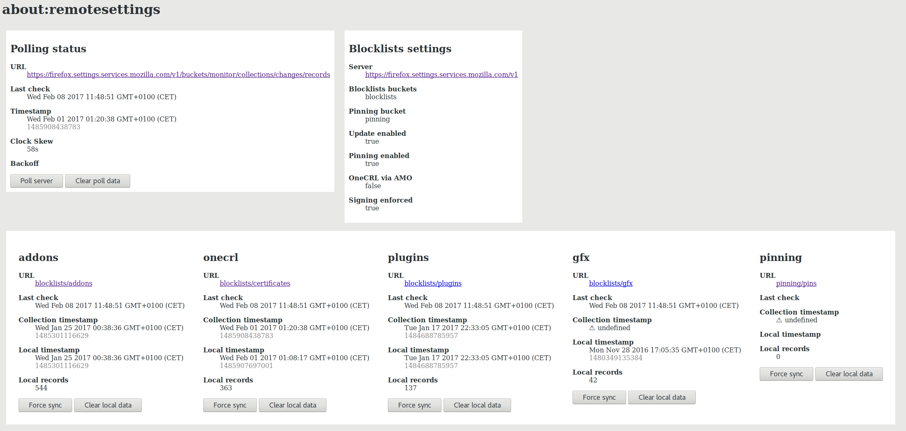

# Remote Settings Devtools

This addon provides some tools to assist developers with remote settings.

# Features

- Trigger synchronization manually
- Inspect local data
- Clear local data
- Switch from/to STAGE and PROD



# Planned Features

- Load from preview collections

# Install

- Pick the .xpi file from the [releases page](https://github.com/mozilla/remote-settings-devtools/releases).
- When asked for comnfirmation, select "Continue to installation".

> Note: it is highly recommended to use a temporary or development user profile

# Development


This addon relies on the [Experiments API](https://firefox-source-docs.mozilla.org/toolkit/components/extensions/webextensions/basics.html#webextensions-experiments) in order to expose Remote Settings internals to the Web Extension.

Unsigned addons with experiments can only be loaded in Firefox Nightly and Developer Edition, with specific preferences set.

1. Download Nightly
2. Install dependencies with `npm install`
3. We'll use the `web-ext` runner, with a persistent profile:
```
web-ext run --verbose --firefox-binary /path/to/nightly/firefox -s extension --firefox-profile rs-devtools --profile-create-if-missing
```
4. (*first run only*) Adjust preferences in `about:config`:
- `xpinstall.signatures.required`: false
- `extensions.experiments.enabled`: true
5. Reload the addon to take these prefs changes into account, in `about:debugging`
6. Enjoy!

# Release

1. Bump version in ``package.json``, ``update.json``, and ``extension/manifest.json``
2. Tag commit ``git tag -a X.Y.Z`` and push it
3. Create release with changelog on Github
4. Check that ``FirefoxCI`` action has run for tagged commit
5. Request sign-off on Slack channel ``#addons-pipeline``
6. Download signed build from Task Cluster, and attach ``remote-settings-devtools-X.Y.Z.xpi`` binary file on Github release page
